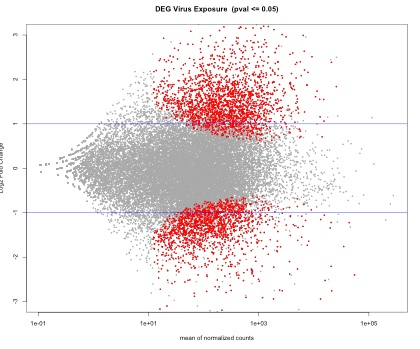

#RNA-seq Cgigas


For this project I will try to find differentially expressed genes in oysters (3) exposed to heat.

Overall steps - will use DESeq2-DAVID-REvigo  and SQLSHARE.


#Count Data

Count data was from CLC and is located in the data directory.

```
Stevens-MacBook-Air-3:Desktop sr320$ cd ASI-rna-seq/
Stevens-MacBook-Air-3:ASI-rna-seq sr320$ ls
data		notebook	output		scripts
Stevens-MacBook-Air-3:ASI-rna-seq sr320$ cd data
Stevens-MacBook-Air-3:data sr320$ curl -O -k https://raw.githubusercontent.com/sr320/austral/master/modules/data/Cgigas-HS-count.txt
  % Total    % Received % Xferd  Average Speed   Time    Time     Time  Current
                                 Dload  Upload   Total   Spent    Left  Speed
100  863k  100  863k    0     0   304k      0  0:00:02  0:00:02 --:--:--  357k
Stevens-MacBook-Air-3:data sr320$ 
```

```
$ head Cgigas-HS-count.txt 
Feature ID	2M-Total	4M-Total	6m-Total	2M-HS-Total	4M-HS-Total	6M-HS-Total
CGI_10000001	25	26	35	56	10	35
CGI_10000002	56	16	36	34	19	29
CGI_10000003	0	19	25	6	79	8
CGI_10000004	0	2	1	5	0	2
CGI_10000005	0	0	0	0	0	0
CGI_10000009	93	68	58	1384	1287	816
CGI_10000010	185	195	254	762	774	1326
CGI_10000011	31	2	10	131	19	17
CGI_10000012	0	0	0	0	0	0
```


#Run DESeq in R


I will be using this page as a reference for analysis.

<http://nbviewer.ipython.org/github/sr320/eimd-sswd/blob/master/eimd_analysis.ipynb>

If running for first time - 

```
source("http://bioconductor.org/biocLite.R")
biocLite("DESeq2")

```


---
`library(DESeq2)`

```
data <- read.table("/Users/sr320/Desktop/ASI-rna-seq/data/Cgigas-HS-count.txt", header = T, sep = "\t")
rownames(data) <- data$Feature
data <- data[,-1]
```


```
deseq2.colData <- data.frame(condition=factor(c(rep("PRE", 3), rep("POST-HS", 3))), 
                             type=factor(rep("single-read", 6)))
rownames(deseq2.colData) <- colnames(data)
deseq2.dds <- DESeqDataSetFromMatrix(countData = data,
                                     colData = deseq2.colData, 
                                     design = ~ condition)
```


```
deseq2.dds <- DESeq(deseq2.dds)
deseq2.res <- results(deseq2.dds)
deseq2.res <- deseq2.res[order(rownames(deseq2.res)), ]
```

```
dim(deseq2.res[!is.na(deseq2.res$padj) & deseq2.res$padj <= 0.05, ])
```

```
tmp <- deseq2.res
# The main plot
plot(tmp$baseMean, tmp$log2FoldChange, pch=20, cex=0.45, ylim=c(-3, 3), log="x", col="darkgray",
     main="DEG Virus Exposure  (pval <= 0.05)",
     xlab="mean of normalized counts",
     ylab="Log2 Fold Change")
# Getting the significant points and plotting them again so they're a different color
tmp.sig <- deseq2.res[!is.na(deseq2.res$padj) & deseq2.res$padj <= 0.05, ]
points(tmp.sig$baseMean, tmp.sig$log2FoldChange, pch=20, cex=0.45, col="red")
# 2 FC lines
abline(h=c(-1,1), col="blue")
```
